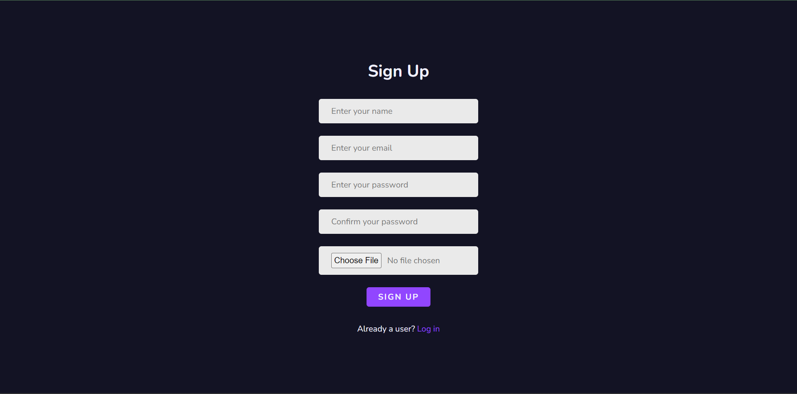
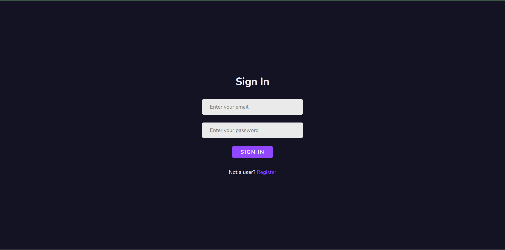
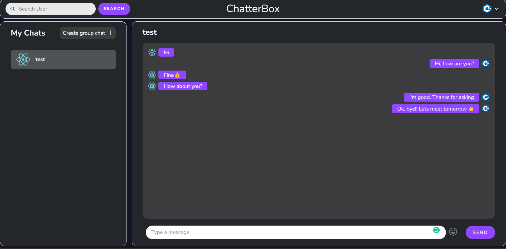
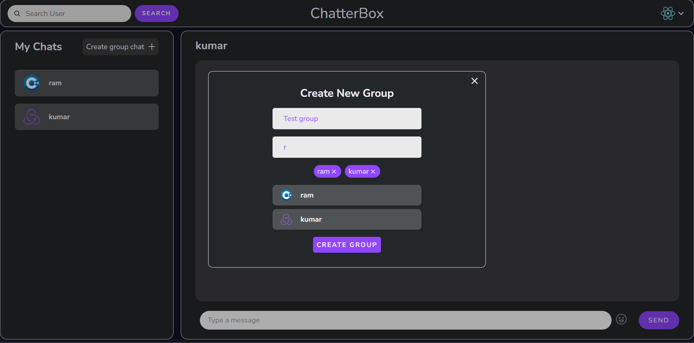
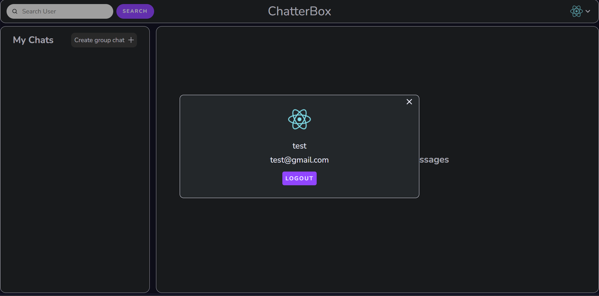
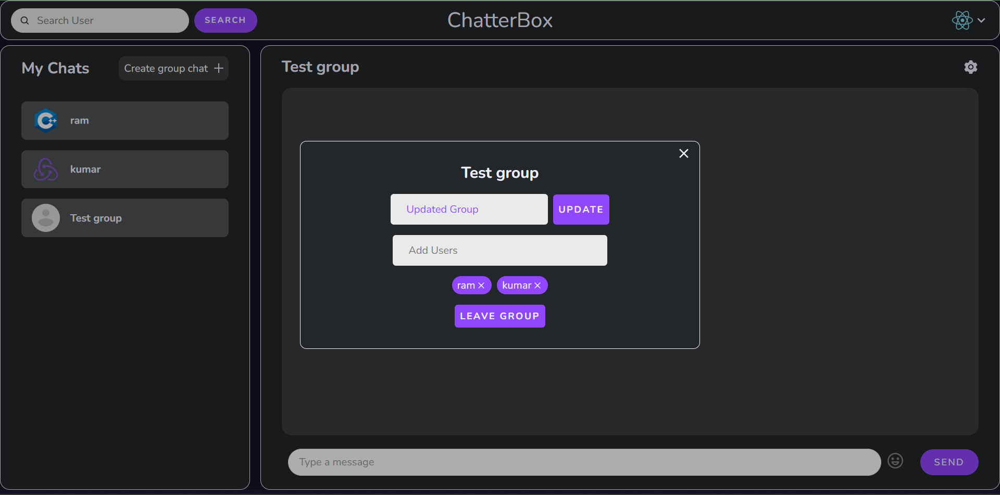

# ChatterBox

<h3>Description :</h3> 
This is a web application where you can chat with others.

👉[Click here](https://chatterbox-main.onrender.com/) to check out the app.
 

### 📃Features :

<ul>
<li>User can register and login.</li>
<li>You can search for others who are using this web app.</li>
<li>User can chat and send emojis to others.</li>
<li>User can create groups.</li>
<li>You can add or remove members from the group.</li>
<li>All your data will be stored on the database so that they can be restored once you login again.</li>
</ul>

### Sign up page

### Sign in page

### Chats page

### Creating groups

### View your profile

### Update your group

